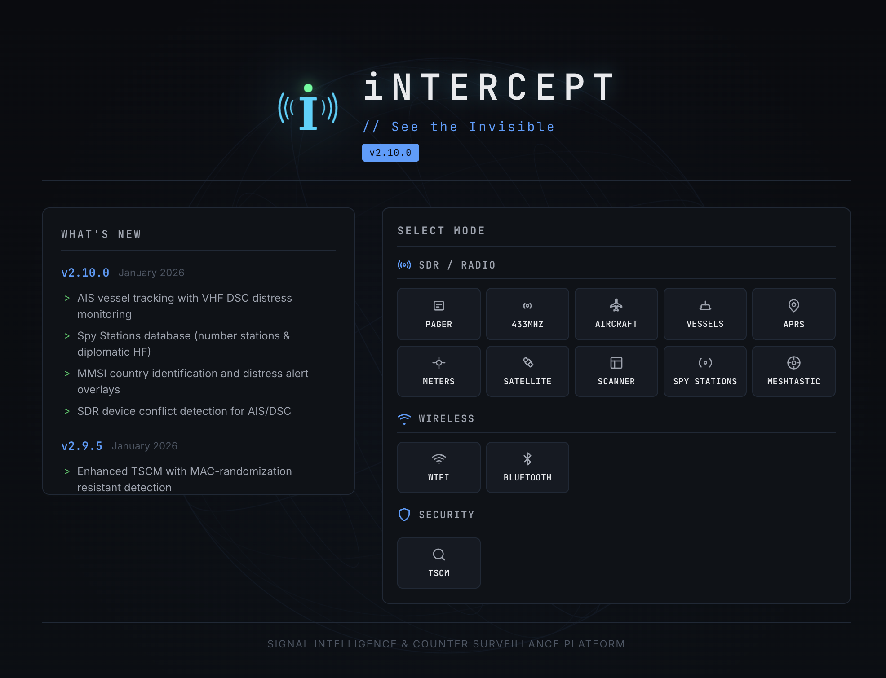

<p align="center">
  
</p>

<p align="center">
  <a href="https://github.com/smittix/intercept">
    
  </a>
  <a href="https://github.com/smittix/intercept/releases">
    
  </a>
  <a href="https://www.python.org/">
    
  </a>
  <a href="https://github.com/smittix/intercept/blob/main/LICENSE">
    
  </a>
</p>

<p align="center">
  <a href="https://github.com/smittix/intercept/stargazers">
    
  </a>
  <a href="https://github.com/smittix/intercept/network/members">
    
  </a>
  <a href="https://github.com/smittix/intercept/issues">
    
  </a>
  <a href="https://github.com/smittix/intercept/actions">
    
  </a>
</p>

<p align="center">
  <a href="#-features">Features</a> •
  <a href="#-installation">Installation</a> •
  <a href="#-hardware">Hardware</a> •
  <a href="#-architecture">Architecture</a> •
  <a href="#-security">Security</a> •
  <a href="#-documentation">Documentation</a>
</p>

---

# 📡 iNTERCEPT

### Signal Intelligence & Counter-Surveillance Platform

**iNTERCEPT** is a web-based signal intelligence platform that brings together software-defined radio, wireless monitoring, protocol decoding, tracking, satellite data, counter-surveillance workflows, and security analysis into a single interface.

> **See the invisible. Understand the signal.**

Designed for researchers, RF enthusiasts, security professionals, radio operators, and authorized laboratory environments.

---

## 🖥️ Interface

<p align="center">
  
</p>

The platform provides a centralized interface for selecting and operating different monitoring modes, including SDR/radio, wireless, satellite, and security workflows.

---

## ✨ Features

### 📻 SDR & Radio

* **Pager Decoding** — POCSAG/FLEX decoding using `rtl_fm` and `multimon-ng`
* **433 MHz Sensors** — Weather stations, TPMS and IoT signal decoding using `rtl_433`
* **Sub-GHz Analyzer** — RF capture and protocol analysis across supported ISM frequencies
* **Aircraft Tracking** — Real-time ADS-B tracking with map and radar views
* **Vessel Tracking** — AIS tracking with VHF DSC monitoring
* **ACARS** — Aircraft datalink message decoding
* **VDL2** — VHF Data Link Mode 2 decoding
* **Listening Post** — Wideband frequency scanning and audio monitoring
* **Satellite Tracking** — Pass prediction, polar plots and ground-track visualization
* **Weather Satellites** — NOAA APT and Meteor LRPT reception and decoding
* **ISS SSTV** — Slow-scan television reception
* **HF SSTV** — Terrestrial SSTV monitoring
* **APRS** — Amateur packet radio position and telemetry data
* **WebSDR** — Remote HF/shortwave receiver integration
* **Utility Meters** — Supported RF meter-reading workflows
* **Space Weather** — Solar, geomagnetic and propagation information

### 📡 Wireless

* **WiFi Scanning**
* **Bluetooth Scanning**
* **Bluetooth Device Location**
* **WiFi Access-Point Location**
* **Meshtastic Integration**
* **MeshCore Integration**
* **GPS Positioning**

### 🛰️ Aviation & Maritime

* ADS-B live aircraft tracking
* ADS-B historical playback
* ACARS message decoding
* VDL2 monitoring
* AIS vessel tracking
* VHF DSC distress monitoring
* APRS tracking
* Remote ID / drone intelligence

### 🛡️ Security & Counter-Surveillance

* **TSCM** — Technical Surveillance Counter-Measures workflows
* RF baseline comparison
* Wireless device detection
* Threat classification
* Examiner ignore lists
* Sweep metadata
* HTML/PDF/JSON/CSV reporting
* Device-clearing workflows
* Signal identification

### 🌌 Space & Satellite

* Satellite pass prediction
* NOAA weather satellite reception
* Meteor LRPT reception
* ISS SSTV
* Space weather dashboards
* Solar imagery
* D-RAP maps
* Aurora forecasting
* Satellite tracking

### 🌐 Distributed Intelligence

* Remote sensor agents
* Distributed monitoring
* Remote data collection
* MQTT event publishing
* Multi-device deployments
* Offline / air-gapped operation

---

# 🧰 Technology Stack

<p align="center">
  
  
  
  
  
</p>

### Core

| Technology     | Role                     |
| -------------- | ------------------------ |
| 🐍 Python 3.9+ | Core application         |
| 🌶️ Flask      | Web framework            |
| 🔌 WebSockets  | Real-time communication  |
| 📡 SDR         | RF signal acquisition    |
| 🐳 Docker      | Containerized deployment |
| 🐘 PostgreSQL  | Optional ADS-B history   |
| 🛰️ Skyfield   | Satellite calculations   |
| 📶 SoapySDR    | Multi-device SDR support |

### External Tools

The platform integrates with a number of established radio and networking tools, including:

* RTL-SDR
* rtl_433
* multimon-ng
* dump1090
* acarsdec
* dumpvdl2
* AIS-Catcher
* direwolf
* SatDump
* aircrack-ng
* HackRF
* BlueZ
* Ubertooth
* SoapySDR
* GPSD

---

# 🚀 Installation

## Requirements

Recommended operating systems:

* Linux
* macOS

Basic requirements depend on the modules you intend to use.

For SDR functionality, supported SDR hardware and the corresponding drivers/tools are required.

---

## ⚡ Quick Start

```bash
git clone https://github.com/smittix/intercept.git
cd intercept

./setup.sh
sudo ./start.sh
```

The setup wizard can detect the environment and install the required components for the selected profiles.

Once the application starts, open:

```text
http://localhost:5050
```

---

# 🐳 Docker

For a containerized installation:

```bash
git clone https://github.com/smittix/intercept.git
cd intercept

docker compose --profile basic up -d --build
```

For ADS-B historical storage:

```bash
docker compose --profile history up -d
```

> **Note:** SDR functionality may require privileged container configuration and USB device passthrough.

---

# 📦 Installation Profiles

The setup system supports modular installation profiles.

| Profile       | Purpose                             |
| ------------- | ----------------------------------- |
| `core`        | Core SDR and signal-decoding tools  |
| `maritime`    | AIS and maritime radio              |
| `weather`     | Weather satellite and related tools |
| `rf-security` | Wireless and RF security tooling    |
| `full`        | Complete installation               |
| `custom`      | Select individual components        |

Example:

```bash
./setup.sh --profile=core,weather
```

Health check:

```bash
./setup.sh --health-check
```

Interactive setup menu:

```bash
./setup.sh --menu
```

---

# 📡 Supported Hardware

iNTERCEPT is designed around software-defined radio and supports multiple hardware families through the appropriate drivers and SoapySDR modules.

### Common Hardware

| Hardware          | Typical Use           |
| ----------------- | --------------------- |
| RTL-SDR           | General SDR reception |
| HackRF            | Wideband RF workflows |
| bladeRF           | Wideband SDR          |
| USRP              | Professional SDR      |
| HydraSDR RFOne    | Wideband reception    |
| SDRplay           | SDR reception         |
| WiFi Adapter      | Wireless monitoring   |
| Bluetooth Adapter | BLE monitoring        |
| GPS Device        | Location and timing   |

> Hardware compatibility depends on the installed drivers, operating system, and selected module.

---

# 🏗️ Architecture

```text
                         ┌──────────────────────┐
                         │      iNTERCEPT       │
                         │    Web Interface     │
                         └──────────┬───────────┘
                                    │
                   ┌────────────────┼────────────────┐
                   │                │                │
                   ▼                ▼                ▼
              SDR / Radio        Wireless        Security
                   │                │                │
          ┌────────┼────────┐   ┌───┼────┐       ┌───┴────┐
          │        │        │   │        │       │        │
         RF      ADS-B     AIS WiFi   Bluetooth  TSCM   Signal ID
          │        │        │   │        │       │
          └────────┴────────┴───┴────────┴───────┘
                           │
                           ▼
                    Data Processing
                           │
                  ┌────────┴────────┐
                  │                 │
                  ▼                 ▼
              Live Data        Historical Data
                  │                 │
                  ▼                 ▼
               Web UI          PostgreSQL
```

---

# 🔧 Configuration

Configuration can be managed through the interactive environment configurator or a `.env` file.

Example:

```env
INTERCEPT_PORT=5050

INTERCEPT_DEFAULT_LAT=51.5074
INTERCEPT_DEFAULT_LON=-0.1278

INTERCEPT_ADSB_AUTO_START=true
```

Keep secrets and credentials out of source control.

Never commit:

```text
.env
credentials
API keys
private certificates
captured sensitive data
database passwords
```

---

# 📊 ADS-B History

iNTERCEPT optionally supports persistent ADS-B history using PostgreSQL.

The history system can provide:

* Historical aircraft data
* Time-based playback
* Reporting dashboards
* Position history
* Long-term analysis

Enable the history profile with:

```bash
docker compose --profile history up -d
```

---

# 🛰️ Satellite & Space Weather

The platform includes satellite-related tools for:

* Satellite pass prediction
* Polar plots
* Ground tracks
* Weather satellite reception
* NOAA APT
* Meteor LRPT
* ISS SSTV
* Solar imagery
* Geomagnetic information
* Aurora forecasting
* HF propagation information

Some space-weather features use public data sources and do not require SDR hardware.

---

# 🛡️ TSCM & Security Research

The TSCM functionality is intended for authorized counter-surveillance and security-assessment workflows.

Capabilities include:

* RF baseline comparison
* Device identification
* Risk categorization
* Examiner metadata
* Device ignore lists
* Cleared-device tracking
* Sweep reporting
* HTML reports
* PDF reports
* JSON/CSV exports

Use these capabilities only where you have appropriate authorization.

---

# 🔐 Security & Responsible Use

iNTERCEPT can interact with radio, wireless, aviation, maritime, and other signal sources.

Users are responsible for complying with:

* Local radio regulations
* Spectrum regulations
* Privacy laws
* Aviation regulations
* Maritime regulations
* Organizational policies
* Applicable cybersecurity laws

Do not use the platform to intercept, monitor, locate, or process communications or devices without appropriate legal authorization.

### Important

**Receiving a signal does not automatically mean you have permission to process, store, publish, or act upon its contents.**

Always understand the legal requirements applicable to your location and use case.

---

# 🧪 Recommended Lab

For security research and experimentation, use an isolated environment:

```text
                    ┌─────────────────────┐
                    │    Security Lab     │
                    │                     │
                    │   ┌─────────────┐   │
                    │   │ iNTERCEPT   │   │
                    │   │ Server      │   │
                    │   └──────┬──────┘   │
                    │          │          │
                    │    Isolated Network │
                    │          │          │
                    │   ┌──────▼──────┐   │
                    │   │ SDR / RF    │   │
                    │   │ Hardware    │   │
                    │   └─────────────┘   │
                    └─────────────────────┘
```

Use test environments whenever possible.

---

# 📚 Documentation

Additional documentation is available in the repository:

| Document                  | Description          |
| ------------------------- | -------------------- |
| `docs/FEATURES.md`        | Feature reference    |
| `docs/HARDWARE.md`        | Hardware information |
| `docs/SECURITY.md`        | Security guidance    |
| `docs/USAGE.md`           | Usage documentation  |
| `docs/TROUBLESHOOTING.md` | Troubleshooting      |
| `docs/UI_GUIDE.md`        | Interface guide      |
| `docs/WEBHOOKS.md`        | Webhook integration  |
| `CHANGELOG.md`            | Release history      |

---

# 🧑‍💻 Development

Install development dependencies:

```bash
pip install -e ".[dev]"
```

Run tests:

```bash
pytest
```

Linting:

```bash
ruff check .
```

Formatting:

```bash
black .
```

Type checking:

```bash
mypy .
```

Pre-commit:

```bash
pre-commit install
```

Live hardware tests are intentionally separated from the normal test suite.

---

# 🗺️ Project Roadmap

Potential areas for continued development include:

* Additional SDR hardware support
* More protocol decoders
* Improved signal identification
* Enhanced visualization
* Distributed sensor management
* Additional historical analytics
* Better reporting
* More automation
* Expanded documentation
* Improved accessibility

---

# 🤝 Contributing

Contributions are welcome.

Before opening a pull request:

1. Fork the repository.
2. Create a feature branch.
3. Make your changes.
4. Run the test suite.
5. Run linting and formatting.
6. Update documentation where necessary.
7. Submit a pull request.

Example:

```bash
git checkout -b feature/my-feature

# Make changes

pytest
ruff check .
black .

git add .
git commit -m "feat: add new feature"
git push origin feature/my-feature
```

---

# 📜 License

iNTERCEPT is released under the **Apache License 2.0**.

See [`LICENSE`](LICENSE) for the complete license text.

---

# ⭐ Support the Project

If you find iNTERCEPT useful:

<p align="center">
  <a href="https://github.com/smittix/intercept">
    
  </a>
  <a href="https://github.com/smittix/intercept/issues">
    
  </a>
  <a href="https://github.com/smittix/intercept/discussions">
    
  </a>
</p>

---

# 📡 iNTERCEPT

<p align="center">
  <strong>Signal Intelligence • SDR • Wireless • Satellite • Security</strong>
</p>

<p align="center">
  <em>See the Invisible.</em>
</p>

<p align="center">
  
</p>

<p align="center">
  <sub>Built for research, experimentation, security analysis, and authorized monitoring.</sub>
</p>
